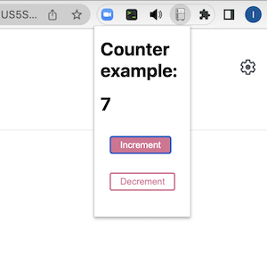

# react-dummy
this repo can be useful as base boilerplate for creating Chrome extension on your knees.

it's based on React version 18.

## css
after some consideration [styled-components](https://styled-components.com/) was chosen as giving the best developer experience (DX)

## in the box
from the start this repo is going with Counter example

## vscode hotkey
use **shift+cmd+b** for fast building app as Chrome extension

or manually **npm rum build-chrome-ext**

## See also
- gihub repo [react-from-scratch](https://github.com/yakkomajuri/react-from-scratch)
